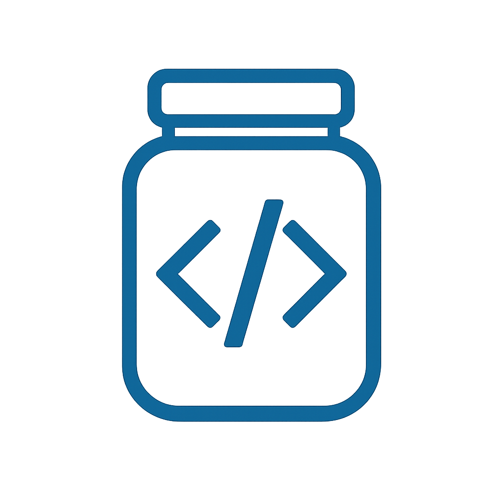

<h1 align="center">Syncjar</h1>

<p align="center">
  <strong>Edit, preview, and sync Skilljar course content locally.</strong>
</p>

<p align="center">
  The local-first Skilljar workflow tool for developers, course authors, and content pros.
</p>

---

**Syncjar** is a command-line tool that lets you pull, edit, preview, and sync course content from [Skilljar](https://www.skilljar.com/) — all from your local development environment.

It's your local **Skilljar workspace**: Write content, test changes, see diffs, and push updates upstream.

---

## ✨ Key Features

- 🔁 **Two-way sync** between Skilljar and local files
- ✍️ **Edit each Skilljar content-item** as a standalone HTML file
- 🔍 **Visual diffs** before syncing changes
- 🧪 **Local preview** mode for testing courses offline
- 💾 Uses the Skilljar API with simple setup

---

## 🗂 Folder Structure

```bash
.
├── local-skilljar/
│   └── <course-slug>/
│       ├── details.json
│       ├── lessons-meta.json
│       └── lessons/
│           └── <lesson-slug>/
│               └── content-<content_item_id>.html
│
├── public/
│   ├── courses/                     # Local preview output
│   └── data/
│       └── courses.json             # Course structure for preview UI
│
├── scripts/
│   ├── sync-skilljar-to-local.mjs   # Pull from Skilljar
│   ├── sync-local-to-skilljar.mjs   # Push to Skilljar (with diffing)
│   ├── generate-courses-json.mjs    # Create preview course index
│
├── .env                             # API key
└── README.md
```

## 🚀 Setup

Clone the repo and install dependencies:

```bash
git clone https://github.com/<your-org>/syncjar.git
cd syncjar
npm install
```

2. Add your Skilljar API key to a .env file:

```env
SKILLJAR_API_KEY=sk-live-abc123
```

3. Pull your Skilljar content and generate the local preview index:

```bash
npm run build:preview
```

## 🔁 Sync Local Edits Back to Skilljar

After editing any content file in `local-skilljar/<course>/lessons/<lesson>/content-<content_item_id>.html`, run:

```bash
npm run sync:push
```

This will show diffs and prompt before updating content upstream.

## 🛠️ Example Workflows

### 🔄 Pull and refresh everything (Skilljar → local)

```bash
npm run build:preview
```

Runs:

```
npm run pull:skilljar
npm run generate:courses
```

### 📝 Edit content locally and preview it

After these scripts have run, you can edit the .html files in `local-skilljar/<course>/lessons/<lesson>/`.

After you make changes, you need to rebuild the local preview index:

```bash
npm run generate:courses
```

Then you can preview the content:

```bash
npx serve public
```

### 📤 Push changes upstream (local → Skilljar)

```bash
npm run sync:push
```

With options:

```bash
# Dry run with diffs
npm run sync:push -- --dry-run

# Push a specific lesson
npm run sync:push -- --course This-Is-My-Course-Title --lesson 03-wrap-up

# Show diffs only (no syncing)
npm run sync:push -- --diff-only

# Push everything without prompting
npm run sync:push -- --force

# Push without showing diffs
npm run sync:push -- --no-diff
```

## 🔒 Connect to Your Course Content

This repo does **not** track course content directly. To use it:

1. Clone your private course content repo:

   ```bash
   git clone git@github.com:<YOUR-ORG>/<YOUR-COURSE-CONTENT-REPO>.git ~/courses
  ```

2. Add to the `.env` file in this repo:

  ```
  COURSE_CONTENT_PATH=../courses
  ```

3. Then run:

  ```bash
  npm run build:preview
  ```

This keeps your course content private and portable across environments.
